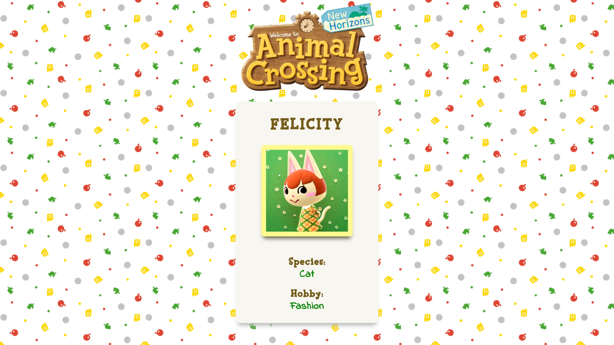

# Animal Crossing Character Randomizer

## Overview

The Animal Crossing Character Randomizer tool that allows you to randomly retrieve character information for all the animals in the popular game, Animal Crossing.

## Features

- Retrieve random character from Animal Crossing New Horizons.
- Access character data, including character image, name, and species.

## Demo

You can check out a live demo of the Animal Crossing API in action [here](link_to_live_demo).

## How It's Made:

**Tech used:** HTML, CSS, JavaScript

The JavaScript part of the project is where the majority of the functionality is implemented. The key elements of the JavaScript code are:

1. The getFetch() function: This function is responsible for fetching character data from the ACNH API and updating the UI elements with the fetched data.

2. Random Character Selection: The getFetch() function generates a random number between 0 and 99, which is used as an identifier to request a random character from the API. This random number ensures that each time the function is called, a different character is displayed.

3. API Fetch: The fetch() function is used to make a GET request to the ACNH API with the constructed URL. The URL is built based on the random choice generated earlier, ensuring that a different character is fetched each time the function is called.

4. Data Handling: Once the API responds with the character data in JSON format, the JavaScript code extracts relevant information like the character's name, image URL, species, and hobby from the response. These details are then used to update the corresponding elements in the HTML.

## API Documentation

For more details, please refer to the [ACNH API documentation](https://acnhapi.com/doc).

## Lessons Learned:

- I gained experience in dynamically updating the content of a webpage with fetched data, improving the user experience by showing random characters each time the user interacts with the tool.
- I became familiar with working with external APIs and understanding their documentation to retrieve specific data points.

## Acknowledgments

Special thanks to [ACNH API](https://github.com/alexislours/ACNHAPI) for the core Animal Crossing API that this project is uses.